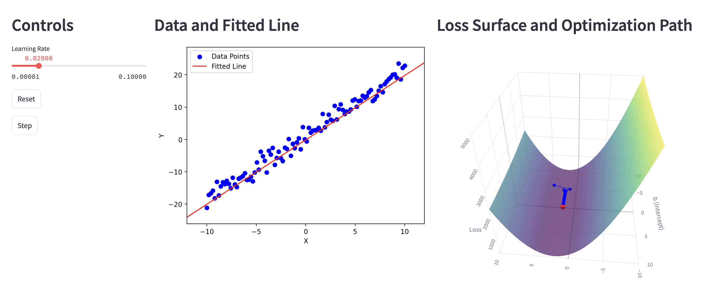

# 📈 Interactive Linear Regression with Gradient Descent (LRGD)

Welcome to the **Interactive Linear Regression** app! This Streamlit app is designed to help you visualize and understand the process of fitting a line to a set of 2D noisy data points using **gradient descent**. It's a great tool for teaching or learning the fundamentals of machine learning algorithms.



## 🌟 Features

- **Data Visualization**: Scatter plot of noisy data points and the fitted line.
- **Interactive Controls**: Adjust the learning rate and step through iterations.
- **Gradient Descent Visualization**: 3D loss surface with the optimization path.
- **Educational**: Detailed comments and explanations within the code.

## 🚀 Getting Started

Follow these instructions to get a copy of the project up and running on your local machine.

### Prerequisites

- **Python 3.7+**
- **pip** (Python package installer)
- **Virtual Environment Tool**: `venv` for both macOS and Windows.

### 🔧 Installation

#### 1. Clone the Repository

```bash
git clone https://github.com/NeoVand/LRGD.git
cd LRGD
```

#### 2. Create a Virtual Environment

##### macOS

```bash
python3 -m venv venv
source venv/bin/activate
```

##### Windows

```bash
python -m venv venv
venv\Scripts\activate
```

#### 3. Install Dependencies

Assuming you have a `requirements.txt` file in your project directory:

```bash
pip install -r requirements.txt
```

**Contents of `requirements.txt`:**

```
streamlit
numpy
matplotlib
plotly
```

### ▶️ Running the App

```bash
streamlit run app.py
```

This will open the app in your default web browser.

## 📝 Understanding the Code

Let's break down the key components of the `app.py` script.

### 1. Imports and Configuration

```python
import numpy as np
import streamlit as st
import matplotlib.pyplot as plt
import plotly.graph_objects as go

st.set_page_config(layout='wide')
```

- **NumPy**: For numerical computations.
- **Streamlit**: To create the interactive web app.
- **Matplotlib**: For plotting the 2D scatter plot.
- **Plotly**: For the interactive 3D loss surface plot.
- **Page Configuration**: Sets the layout to wide for better visualization.

### 2. Data Generation

```python
def generate_data(num_points=100, true_a=2.0, true_b=1.0, noise_std=2.0):
    X = np.linspace(-10, 10, num_points)
    noise = np.random.normal(0, noise_std, num_points)
    Y = true_a * X + true_b + noise
    return X, Y
```

- Generates `num_points` along a line defined by `true_a` (slope) and `true_b` (intercept).
- Adds Gaussian noise to simulate real-world data.

### 3. Loss Computation

```python
def compute_loss(a, b, X, Y):
    N = len(X)
    Y_pred = a * X + b
    loss = (1 / N) * np.sum((Y - Y_pred) ** 2)
    return loss
```

- Calculates the **Mean Squared Error (MSE)** between the predicted `Y_pred` and actual `Y`.

### 4. Gradient Computation

```python
def compute_gradients(a, b, X, Y):
    N = len(X)
    Y_pred = a * X + b
    dL_da = (-2 / N) * np.sum(X * (Y - Y_pred))
    dL_db = (-2 / N) * np.sum(Y - Y_pred)
    return dL_da, dL_db
```

- Computes gradients of the loss function with respect to `a` and `b`.
- These gradients indicate the direction to adjust `a` and `b` to minimize the loss.

### 5. User Interface Controls

```python
learning_rate = st.slider('Learning Rate', min_value=0.00001, max_value=0.1, value=0.001, step=0.00001, format="%.5f")
reset_button = st.button('Reset')
step_button = st.button('Step')
```

- **Learning Rate Slider**: Adjusts how big each step of gradient descent is.
- **Reset Button**: Resets the model to initial random parameters.
- **Step Button**: Executes one iteration of gradient descent.

### 6. Session State Initialization

```python
if 'initialized' not in st.session_state or reset_button:
    # Initialization code...
```

- Uses `st.session_state` to store variables across user interactions.
- Initializes or resets data points, parameters, and plotting ranges.

### 7. Gradient Descent Step

```python
if step_button:
    # Gradient computation and parameter updates...
```

- Updates parameters `a` and `b` using the gradients and the learning rate.
- Appends the new parameters and loss to history lists for plotting.

### 8. Plotting the Data and Fitted Line

```python
fig, ax = plt.subplots()
ax.scatter(X_data, Y_data, label='Data Points', color='blue')
ax.plot(X_line, Y_line, color='red', label='Fitted Line')
ax.set_xlim(st.session_state.xmin, st.session_state.xmax)
ax.set_ylim(st.session_state.ymin, st.session_state.ymax)
st.pyplot(fig)
```

- Plots the noisy data points and the current fitted line.
- Axis limits are fixed to prevent rescaling during updates.

### 9. Plotting the Loss Surface and Optimization Path

```python
fig = go.Figure()
fig.add_trace(go.Surface(...))
fig.add_trace(go.Scatter3d(...))  # Old points
fig.add_trace(go.Scatter3d(...))  # Current point
st.plotly_chart(fig)
```

- **3D Loss Surface**: Visualizes how the loss changes with different `a` and `b`.
- **Optimization Path**: Shows the trajectory of `a` and `b` values during gradient descent.
- **Color Coding**:
  - Old points are in **blue**.
  - Current point is in **red**.

## 📚 Learning Outcomes

- **Gradient Descent**: Understand how parameters are updated to minimize the loss.
- **Loss Landscape**: Visualize the optimization process in the context of the loss surface.
- **Impact of Learning Rate**: See how changing the learning rate affects convergence.
- **Interactive Exploration**: Hands-on experience with key machine learning concepts.

## 🛠️ Customization

Feel free to modify the code to:

- Change the true slope and intercept of the generated data.
- Adjust the noise level to see its effect on fitting.
- Implement different optimization algorithms.
- Extend the model to polynomial regression.

## 🤝 Contributing

Contributions are welcome! Please fork the repository and submit a pull request.

## 📄 License

This project is licensed under the MIT License.

## 🙏 Acknowledgments

- **Streamlit Community**: For making data apps so accessible.
- **Machine Learning Enthusiasts**: Keep exploring and learning!

---

Happy Coding! 😊